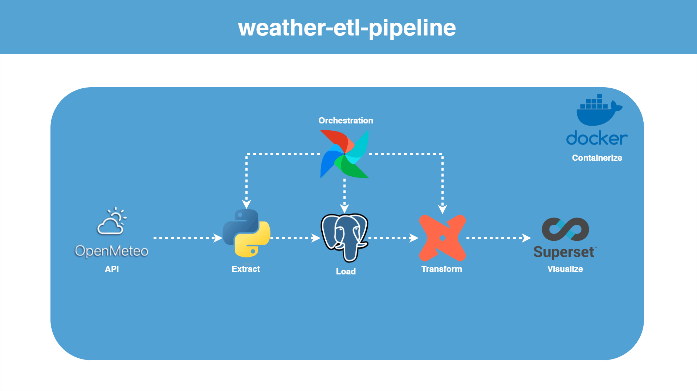

# weather-etl-pipeline

An end-to-end data pipeline that extracts, loads, and transforms weather
data for multiple cities using the [Open-Meteo](https://open-meteo.com/)
API, and presents it through an interactive Superset dashboard. The
pipeline is fully containerized and orchestrated with Apache Airflow.



## Overview

The pipeline pulls three types of data for each tracked city: current
conditions, hourly forecasts, and daily historical actuals. Because
Open-Meteo provides both forecasts and later-observed outcomes, the project
also includes a forecast-accuracy analysis, comparing predicted values
against what actually occurred, broken down by lead time.

**Key technical elements:**

- **Data modeling**: raw data is landed in append-only tables and
  transformed through a staging, intermediate, and mart layered
  architecture in dbt, resulting in a star schema (fact and dimension
  tables) suitable for BI tooling
- **Orchestration**: Apache Airflow schedules and sequences extraction,
  transformation, and automated data quality checks
- **Data quality**: dbt tests enforce not-null and uniqueness constraints
  across staging models and mart keys
- **Analytics engineering**: derived metrics include daily rollups,
  forecast error by lead time, and wind direction/speed distributions
- **Visualization**: a six-chart Superset dashboard covering time series,
  geospatial, calendar, and categorical views
- **Infrastructure**: the full stack (Postgres, Airflow, dbt, Superset)
  runs via Docker Compose, with environment-based configuration and no
  secrets committed to version control
- **CI**: GitHub Actions validates the extraction module and the dbt
  project on every push

## Tech stack

| Layer | Tools |
|---|---|
| Language | Python |
| Database | PostgreSQL |
| Transformation | dbt |
| Orchestration | Apache Airflow |
| Visualization | Apache Superset |
| Infrastructure | Docker, Docker Compose |
| CI/CD | GitHub Actions |
| Data source | Open-Meteo API (REST) |

## Architecture

```
Open-Meteo API
      │
      ▼
extraction/extract.py  ──▶  raw tables in Postgres
      │
      ▼
  Airflow DAG: extract  →  dbt run  →  dbt test
                                 │
                                 ▼
              dbt staging  →  dbt intermediate  →  dbt marts
              (clean/type)    (rollups, joins)     (star schema)
                                 │
                                 ▼
                          Superset dashboard
```

## Project structure

- **extraction/** Python module that geocodes each city and pulls current
  conditions, hourly forecasts, and historical actuals from Open-Meteo
- **dags/** Airflow DAG that runs extraction, then dbt, then dbt tests
- **dbt/** staging, intermediate, and mart models implementing the star
  schema
- **superset/dashboards/** exported dashboard definition, version
  controlled alongside the code
- **postgres/** database provisioning scripts for the Airflow and Superset
  metadata databases
- **docker/** Superset configuration and startup scripts

## Setup

Requires Docker and Docker Compose. No API key is required, as Open-Meteo
is free and unauthenticated.

1. Copy the environment template and adjust as needed (tracked cities,
   historical backfill window, database credentials):

   ```bash
   cp .env.example .env
   ```

2. Copy the dbt profile template (kept out of version control, since it is
   the file dbt actually reads):

   ```bash
   cp dbt/profiles.yml.example dbt/profiles.yml
   ```

3. Start the stack:

   ```bash
   docker compose up -d
   ```

4. Access the services:

   | Service  | URL                     | Notes                          |
   |----------|-------------------------|---------------------------------|
   | Airflow  | http://localhost:8000   | admin password generated on first boot (see below) |
   | Superset | http://localhost:8088   | default admin / admin, change before any non-local use |
   | Postgres | localhost:5000          | credentials in `.env`          |

   Retrieve the generated Airflow admin password:

   ```bash
   docker compose exec af cat /opt/airflow/simple_auth_manager_passwords.json.generated
   ```

5. In the Airflow UI, unpause the `weather-etl-orchestrator` DAG. Each run
   extracts current conditions, forecast data, and one day of historical
   actuals for every configured city, loads the raw tables, and runs the
   dbt transformation and test suite.

**Note on data volume**: several charts (forecast accuracy, the
precipitation calendar, wind distribution, extreme-heat tracking) depend on
multiple days of accumulated history and will show sparse results after a
single run. This reflects the nature of the underlying metrics rather than
a defect in the pipeline.

## Running components manually

```bash
# Extraction, from the host
pip install -r extraction/requirements.txt
POSTGRES_HOST=localhost POSTGRES_PORT=5000 python extraction/extract.py

# dbt, inside the dbt container
docker compose run --rm dbt run
docker compose run --rm dbt test
```

## Data model

- **Staging**: one model per raw source, deduplicated and typed
- **Intermediate**: `int_daily_current_rollup` (daily averages from
  current-condition pulls), `int_forecast_accuracy` (forecast rows joined
  to their later-observed actuals, with lead time and error computed),
  `int_wind_distribution` (wind observations binned into 16-point compass
  directions and speed buckets)
- **Marts**:
  - `dim_location`, `dim_date`: dimension tables
  - `fact_weather_observations`: daily grain, combining historical actuals
    with same-day current-condition averages
  - `fact_forecast_accuracy`: forecast issuance vs. actual outcome, by
    lead time
  - `mart_wind_distribution`: wind observation counts by direction and
    speed bucket, used in place of a native wind-rose chart

## Dashboard

The "Weather ETL Overview" dashboard includes six charts, cross-filterable
by city:

- **Daily Temperature by City**: daily high/low trends over time
- **Forecast Accuracy by Lead Time**: mean temperature error grouped by
  forecast lead time
- **Precipitation Calendar Heatmap**: daily precipitation shown as a
  calendar view
- **Current Conditions Map**: geospatial view of the latest observation
  per city
- **Extreme Heat Days by Month**: monthly count of days exceeding a
  configurable temperature threshold
- **Wind Direction & Speed Distribution**: stacked bar chart approximating
  a wind rose

The dashboard definition is exported to `superset/dashboards/` and can be
restored on a fresh Superset instance via Dashboards > Import dashboard.
